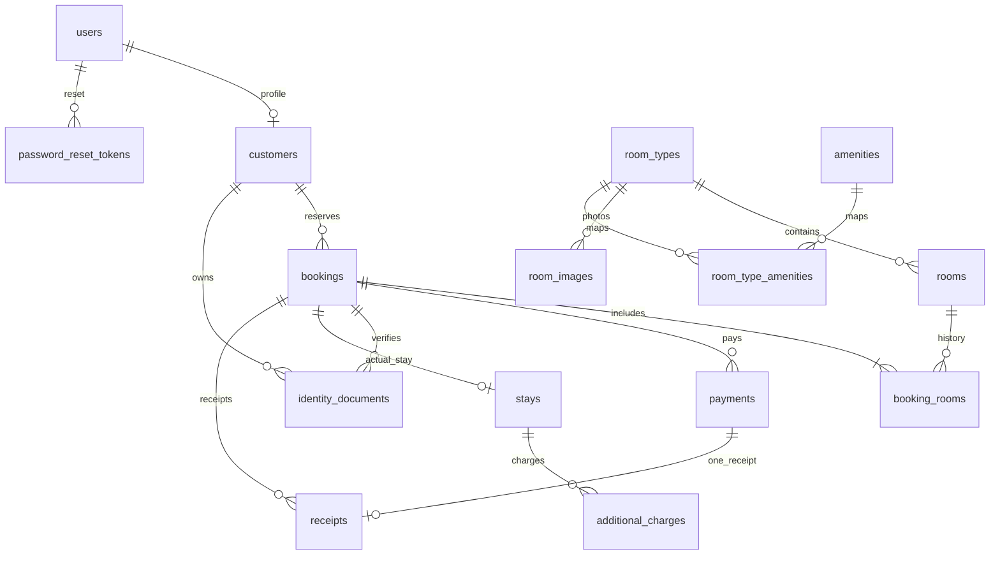

# พจนานุกรมฐานข้อมูล HMS Hotel

แหล่งอ้างอิง: [backend/test/schema.sql](../backend/test/schema.sql) และโค้ด backend/src/modules ปัจจุบัน อ่านคู่กับ [คู่มือส่งต่อ](PROJECT-HANDOFF-TH.md) และ [แผนที่ไฟล์](FILE-MAP-TH.md) ไม่ใช่ dump ข้อมูลจริงจาก MySQL

## 1. ภาพรวมความสัมพันธ์

ฐานข้อมูลชื่อ hotel_management ใช้ InnoDB/utf8mb4 มี 15 ตาราง PK ส่วนใหญ่เป็น INT UNSIGNED AUTO_INCREMENT ตารางเชื่อม room_type_amenities ใช้คีย์คู่

แผนภาพแสดงวงจรหลักตามการใช้งาน แถว booking_rooms อย่างน้อย 1 แถวต่อการจองถูกบังคับโดย backend ไม่ใช่ FK เพียงอย่างเดียว ยังมี FK ผู้ดำเนินการไป users ผ่าน cancelled_by, verified_by, reviewed_by, check_in_by/check_out_by, created_by และ issued_by

identity_documents ผูก (booking_id,customer_id) กับ bookings แบบ composite FK เพื่อให้เจ้าของเอกสารตรงกับการจอง; receipts ผูก (payment_id,booking_id) กับ payments เพื่อให้ใบเสร็จตรงกับการจองของ payment

## 2. ข้อมูลแต่ละตารางและนำไปใช้ที่ไหน

| ตาราง / PK | ข้อมูลสำคัญและความหมาย | API ที่นำไปใช้ได้ | ไฟล์ backend / หน้า Vue |
|---|---|---|---|
| users / user_id | username,email,password_hash,role,account_status,last_login_at และเวลา create/update | สมัคร/ล็อกอิน; GET /me คืน user_id,username,email,role; hash ไม่คืนให้ UI | auth.service.js, authenticate.js, app.js → Auth/App/Profile |
| customers / customer_id | user_id unique ผูกบัญชี; title,first_name,last_name,phone,birth_date,gender,address,province,postal_code,nationality และเวลา | register กรอกชื่อ/โทร; GET/PATCH /me/profile ใช้เฉพาะชุดที่อธิบายด้านล่าง; booking list/detail ได้ชื่อ | auth.service.js, catalog.routes.js, bookings.routes.js → Profile/Booking/MyBookings/BookingDetail |
| password_reset_tokens / reset_id | user_id,token_hash,expires_at,used_at,created_at; hash SHA256 ของ token | POST forgot/reset; ไม่ให้ UI อ่านตาราง token | reset-password.routes.js → Auth |
| room_types / room_type_id | type_name,description,price_per_night,adult_capacity,child_capacity,bed_count,bed_type,room_size,status และเวลา | public list/detail, availability, admin CRUD | app.js, catalog.routes.js, room-types.routes.js, availability.routes.js → Home/Rooms/RoomDetail/AdminCatalog |
| rooms / room_id | room_number unique,floor,room_type_id,room_status,note และเวลา | public availability; admin list/detail/CRUD; booking detail | rooms.routes.js, availability.routes.js, bookings.routes.js, stays.routes.js → Rooms/Booking/AdminCatalog/BookingDetail |
| room_images / image_id | room_type_id,file_path,description,is_primary,display_order,primary_type_id generated; รูปเป็นระดับประเภทห้อง | public detail images[].url/list image_url/file; admin upload/delete | catalog.routes.js, room-types.routes.js, app.js → RoomDetail/RoomCard/AdminCatalog |
| amenities / amenity_id | amenity_name unique,icon,description,status | public active list/detail; admin list/create/patch; ไม่มี delete | catalog.routes.js → RoomDetail/AdminCatalog |
| room_type_amenities / (room_type_id,amenity_id) | สอง FK เชื่อมหลายประเภทกับหลาย amenities | PUT /admin/room-types/:id/amenities แทนชุดเดิม; detail คืนรายการ | catalog.routes.js, room-types.routes.js → RoomDetail/AdminCatalog |
| bookings / booking_id | booking_number unique,customer_id,วันเข้า/ออก,คนรวม,nights generated,total_amount ค่าห้อง,status,คำขอ,expiry,ข้อมูลยกเลิกและเวลา | POST/list/detail/cancel/no-show; status เปลี่ยนตามเงิน/เอกสาร/stay | bookings.routes.js และ helper/routes วงจรจอง → Booking/MyBookings/BookingDetail |
| booking_rooms / booking_room_id | booking_id,room_id,price_per_night snapshot,nights,room_total generated,คนต่อห้อง; booking+room unique | สร้างพร้อม booking, อ่านจาก detail; ไม่มี CRUD แยก | bookings.routes.js, availability.routes.js, rooms.routes.js, stays.routes.js → Booking/BookingDetail |
| payments / payment_id | payment_number unique,booking_id,reference_number,amount,method,proof_path,paid_at,status,note,ผู้ตรวจ/เวลา,เวลาคืนเงินและเวลา create/update | upload/cash/list/proof/verify/refund; detail คืนฟิลด์บางส่วน | payments.routes.js, reports.routes.js, hotel.js → BookingDetail/AdminReviews/AdminReports |
| identity_documents / document_id | booking_id,customer_id,document_type,document_number masked,file_path,status,review_note,ผู้ตรวจ/เวลา upload/review | upload/list/file/review; detail คืน id/type/status/note | documents.routes.js → BookingDetail/AdminReviews |
| stays / stay_id | booking_id unique,actual_check_in/out,check_in_by/out_by,note | check-in/out; detail คืน stay_id และเวลาจริง ไม่คืนผู้ดำเนินการ/note | stays.routes.js, bookings.routes.js → BookingDetail |
| additional_charges / charge_id | stay_id,charge_name,quantity,unit_price,total_amount generated,created_at/by,note | admin เพิ่มระหว่าง checked_in; detail คืน charges[] และ financial รวม | stays.routes.js, bookings.routes.js, hotel.js → BookingDetail |
| receipts / receipt_id | receipt_number unique,booking_id,payment_id unique,issued_at,room_amount,additional_amount,net_amount generated,pdf_path,issued_by | สร้างอัตโนมัติเมื่อตรวจเงินสำเร็จ; detail คืนรายการ; GET PDF | payments.routes.js, reports.routes.js → BookingDetail |

ชื่อไฟล์ backend แบบย่อด้านบนค้นตำแหน่งเต็มได้ใน FILE-MAP-TH.md API ในตารางละ /api ไว้

## 3. ฟิลด์มีใน DB แต่ UI/API ยังใช้ไม่ครบ

| ฟิลด์ | สภาพปัจจุบัน | ถ้าอยากใช้ต้องทำอะไร |
|---|---|---|
| customers.title/birth_date/gender/nationality | schema รองรับ แต่ register/profile ไม่รับและ GET profile ไม่คืน | เพิ่ม validation/select/update ใน catalog.routes.js และฟอร์ม Profile.vue; register ถ้าต้องกรอกตอนสมัครให้เพิ่ม auth.validation/service |
| users.account_status/role | auth ใช้ตรวจจริง; GET /me คืน role แต่ไม่มีหน้าปิดบัญชี/เปลี่ยนบทบาท | สร้าง admin API สำหรับจัดการบัญชีและ UI ใหม่; ห้ามส่ง role ผ่าน register |
| users.email/username | แสดงผ่าน session และ /me; profile ไม่รับแก้ | เพิ่ม endpoint/กฎ uniqueness/การยืนยันตามที่กำหนดก่อนเพิ่มฟอร์ม |
| room_types.bed_count | public detail/admin/availability คืน; public list ไม่คืน | ใช้ detail หรือเพิ่ม column ใน GET /room-types ที่ app.js |
| amenities.icon | รับ/คืนเป็น string แต่ RoomDetail แสดง Check ร่วม | map icon string กับ component ที่รองรับใน UI |
| room_images.primary_type_id | generated เพื่อ unique รูปหลัก 1 รูปต่อประเภท ไม่ใช่ input | อย่าส่งเอง ใช้ is_primary ตอน upload |
| room_images.description/display_order/is_primary | ตั้งตอน upload ได้; API detail คืน; ไม่มี patch metadata รูปเดิม | เพิ่ม endpoint ถ้าต้องการจัดลำดับ/เปลี่ยนรูปหลักของภาพที่มีอยู่ |
| payments.reference_number/note/paid_at | admin list คืน แต่ payments[] ใน booking detail ไม่คืน | ใช้ admin list ตามสิทธิ์ หรือขยาย SELECT ใน bookings.routes.js อย่างระมัดระวัง |
| payments.verified_by/verified_at/refunded_at | เขียนตาม verify/refund ไม่คืนครบใน list/detail | เพิ่ม response ให้หน้าประวัติตรวจสอบถ้าจำเป็น |
| identity_documents.document_number | nullable; upload ไม่รับและไม่เขียน ไม่ควรเก็บเลขบัตรเต็ม | กำหนดการ mask/สิทธิ์ก่อนขยาย documents.routes.js |
| identity_documents.reviewed_by/reviewed_at | เขียนเมื่อ review ไม่คืนในรายการปัจจุบัน | เพิ่ม SELECT ถ้าจะออกแบบชื่อ/เวลาผู้ตรวจ |
| stays.note/check_in_by/check_out_by | note ตั้งเมื่อเช็กอินได้ผ่าน API; UI ปัจจุบันส่ง {} ; detail ไม่คืน | เพิ่ม SELECT/ฟอร์มใน BookingDetail ตามที่จำเป็น |
| additional_charges.created_by/created_at | เขียนจริง แต่ charges[] detail ไม่คืน | เพิ่ม response สำหรับประวัติคนเพิ่มค่าใช้จ่าย |
| receipts.pdf_path | nullable; โค้ดไม่บันทึก PDF ลง path นี้ PDF ถูกสร้างในหน่วยความจำเมื่อเรียก | ใช้ /receipts/:id/pdf; ต้องพัฒนาเพิ่มถ้าจะเก็บ PDF ถาวร |
| file_path/proof_path | key ชื่อสุ่มของไฟล์บน disk ไม่ใช่ URL หน้าเว็บ | ใช้ endpoint file/proof ของระบบ ไม่เปิด path โดยตรง |

GET /me/profile คืน customer_id,first_name,last_name,phone,address,province,postal_code; PATCH รับ 6 ฟิลด์หลัง customer_id เท่านั้น ไม่รับ customer_id/user_id

GET /bookings/:id คืนข้อมูลหลัก booking รวมชื่อ/user_id/hold_expired จาก join แล้วเพิ่ม:

- rooms: booking_rooms fields + room_number,type_name
- payments: payment_id,payment_number,amount,payment_method,payment_status,created_at
- documents: document_id,document_type,document_status,review_note
- receipts: receipt_id,receipt_number,payment_id,net_amount
- stay: stay_id,actual_check_in,actual_check_out หรือ null
- charges: charge_id,charge_name,quantity,unit_price,total_amount,note
- financial: room_amount,additional_amount,grand_total,paid_amount,balance

จึงไม่ควรสมมติว่า SELECT ทั้งตารางจาก API ทุกครั้ง response เป็นชุดข้อมูลที่ route ตั้งใจเปิดให้ดู

## 4. สถานะ ค่าเงิน วันที่ และข้อมูลที่ระบบคำนวณ

| ตาราง | ค่าที่รองรับ |
|---|---|
| users.role | admin, customer |
| users.account_status | active, disabled |
| room_types.status / amenities.status | active, inactive |
| rooms.room_status | available, occupied, cleaning, maintenance, inactive; admin CRUD ตั้ง occupied ตรง ๆ ไม่ได้ |
| bookings.booking_status | pending, confirmed, checked_in, checked_out, cancelled, expired, no_show |
| payments.payment_method | cash, bank_transfer, promptpay |
| payments.payment_status | pending, successful, failed, refunded |
| identity_documents.document_type | national_id, passport |
| identity_documents.document_status | pending, approved, rejected |

| ค่าคำนวณ | สูตร/ที่มาจริง |
|---|---|
| bookings.nights | DATEDIFF(check_out_date,check_in_date) generated |
| booking_rooms.room_total | price_per_night × nights generated |
| bookings.total_amount | backend รวม room_total; ค่าห้องเท่านั้น |
| additional_charges.total_amount | quantity × unit_price generated |
| receipts.net_amount | room_amount + additional_amount generated ต่อ payment |
| financial.additional_amount | SUM charges ที่เชื่อมผ่าน stays.booking_id |
| financial.grand_total | bookings.total_amount + additional_amount |
| financial.paid_amount | SUM payments เฉพาะ successful; refunded ไม่รวม |
| financial.balance | grand_total - paid_amount |
| ยอดที่ UI ให้ส่ง payment ใหม่ | max(0, balance - SUM pending payments) |
| cash flow | รับจาก successful/refunded ตาม paid_at หัก refunded ตาม refunded_at แยกวัน |

ห้ามส่ง generated columns หรือยอด authoritative จาก frontend ไประบุแทน backend ราคาใน booking_rooms เป็น snapshot จึงเปลี่ยน room_types.price_per_night แล้วการจองเดิมยังราคาเดิม แต่ชื่อประเภทห้องใน detail เป็นชื่อปัจจุบันจาก join ไม่มี snapshot ชื่อ

DECIMAL ใน schema ใช้เงิน 12,2 ขนาดห้อง 8,2; mysql2 มักตอบ decimal เป็น string; เงินใน helper backend คิดด้วย BigInt หน่วยสตางค์เพื่อป้องกัน floating point

วันที่ API เป็น YYYY-MM-DD ส่วน DATETIME เป็นค่าจาก DB ที่ pool คืนเป็น string ไม่มี timezone suffix ชัดเจน ตัว countdown frontend ตีความ +07:00 และวันที่วันนี้ใช้ Asia/Bangkok จึงต้องตรวจ timezone ของ MySQL/runtime เมื่อ deploy

## 5. ข้อมูลตัวอย่างที่ seed ใส่จริง

| room_type_id | type_name | ราคา/คืน | ผู้ใหญ่/เด็ก | เตียง | ขนาด ตร.ม. | ห้องจริง |
|---|---|---|---|---|---|---|
| 1 | Standard Double | 900.00 | 2/1 | 1 Double | 24 | 101,102 ชั้น 1 |
| 2 | Standard Twin | 1000.00 | 2/1 | 2 Twin | 26 | 103,104 ชั้น 1 |
| 3 | Deluxe | 1500.00 | 2/1 | 1 King | 32 | 201,202 ชั้น 2 |
| 4 | Family | 2200.00 | 4/2 | 2 Double | 45 | 203,204 ชั้น 2 |

amenities IDs 1–6: Wi-Fi, เครื่องปรับอากาศ, โทรทัศน์, ตู้เย็น, เครื่องทำน้ำอุ่น, ไดร์เป่าผม ประเภท 1–2 มี IDs 1,2,3,5; ประเภท 3–4 มีทั้ง 6 รายการ รวม 20 คู่ room_type_amenities ห้อง default available และประเภท/amenities default active

ยังไม่มี seed users/customers/password_reset_tokens/room_images/bookings/booking_rooms/payments/identity_documents/stays/additional_charges/receipts ข้อมูล runtime ต้องสร้างผ่านระบบ ไม่มีรหัส admin สาธารณะฝังใน seed

## 6. ข้อจำกัดของ schema และการจัดเก็บ

FK ไม่มี cascade delete ใน schema ประวัติห้อง/ประเภทที่มีข้อมูลอ้างอิงจึงลบไม่ได้ ใช้ inactive เมื่อกฎ backend อนุญาต; booking_rooms unique ต่อ booking+room; payments reference unique ต่อ method+reference_number (NULL ได้หลายแถว); payment หนึ่งมี receipt ได้มากสุดหนึ่ง

CHECK ตรวจเงื่อนไขพื้นฐาน เช่นราคาไม่ติดลบ วันออกหลังวันเข้า ผู้ใหญ่ >0 payment successful ต้องมี paid_at/verified_at/verified_by แต่การจองช่วงวันไม่ทับกัน ความจุ ราคาอ้างอิง การเงินสมดุล และสิทธิ์ข้ามตารางต้องอาศัย transaction/backend ไม่ใช่ดู ERD แล้วถือว่าฐานข้อมูลบังคับทุกกฎ

เนื้อไฟล์อัปโหลดอยู่ backend/private-storage ตารางเก็บเพียง key ไม่มี BLOB ใน DB รูปห้องเข้าถึง public เฉพาะประเภท active ส่วนสลิป/เอกสารต้องเป็น owner หรือ admin หลังผ่าน authenticate การสำรองต้องเก็บ DB และไฟล์ให้ตรงกัน

## 7. คอลัมน์และชนิดข้อมูลทั้งหมดจาก schema

ภาคผนวกด้านล่างคัดเฉพาะบรรทัดนิยามคอลัมน์จาก schema เพื่อให้เทียบชนิดข้อมูล/NULL/default ได้ครบ คำอธิบายการใช้งานอยู่หัวข้อ 2–4; constraints/FK/index และสูตร generated ที่เต็มให้อ่าน schema ต้นฉบับ บรรทัด computed ที่แยกหลายบรรทัดจะสรุปตามสูตรหัวข้อ 4

### users

| คอลัมน์ | นิยาม SQL |
|---|---|
| user_id | INT UNSIGNED AUTO_INCREMENT PRIMARY KEY |
| username | VARCHAR(50) NOT NULL UNIQUE |
| email | VARCHAR(150) NOT NULL UNIQUE |
| password_hash | VARCHAR(255) NOT NULL |
| role | VARCHAR(20) NOT NULL DEFAULT 'customer' |
| account_status | VARCHAR(20) NOT NULL DEFAULT 'active' |
| last_login_at | DATETIME NULL |
| created_at | DATETIME NOT NULL DEFAULT CURRENT_TIMESTAMP |
| updated_at | DATETIME NOT NULL DEFAULT CURRENT_TIMESTAMP ON UPDATE CURRENT_TIMESTAMP |

### customers

| คอลัมน์ | นิยาม SQL |
|---|---|
| customer_id | INT UNSIGNED AUTO_INCREMENT PRIMARY KEY |
| user_id | INT UNSIGNED NOT NULL UNIQUE |
| title | VARCHAR(20) |
| first_name | VARCHAR(100) NOT NULL |
| last_name | VARCHAR(100) NOT NULL |
| phone | VARCHAR(20) NOT NULL |
| birth_date | DATE |
| gender | VARCHAR(20) |
| address | TEXT |
| province | VARCHAR(100) |
| postal_code | VARCHAR(10) |
| nationality | VARCHAR(60) |
| created_at | DATETIME NOT NULL DEFAULT CURRENT_TIMESTAMP |
| updated_at | DATETIME NOT NULL DEFAULT CURRENT_TIMESTAMP ON UPDATE CURRENT_TIMESTAMP |

### password_reset_tokens

| คอลัมน์ | นิยาม SQL |
|---|---|
| reset_id | INT UNSIGNED AUTO_INCREMENT PRIMARY KEY |
| user_id | INT UNSIGNED NOT NULL |
| token_hash | VARCHAR(255) CHARACTER SET ascii COLLATE ascii_bin NOT NULL UNIQUE |
| expires_at | DATETIME NOT NULL |
| used_at | DATETIME |
| created_at | DATETIME NOT NULL DEFAULT CURRENT_TIMESTAMP |

### room_types

| คอลัมน์ | นิยาม SQL |
|---|---|
| room_type_id | INT UNSIGNED AUTO_INCREMENT PRIMARY KEY |
| type_name | VARCHAR(100) NOT NULL UNIQUE |
| description | TEXT |
| price_per_night | DECIMAL(12,2) NOT NULL |
| adult_capacity | INT NOT NULL |
| child_capacity | INT NOT NULL DEFAULT 0 |
| bed_count | INT NOT NULL DEFAULT 1 |
| bed_type | VARCHAR(50) |
| room_size | DECIMAL(8,2) |
| status | VARCHAR(20) NOT NULL DEFAULT 'active' |
| created_at | DATETIME NOT NULL DEFAULT CURRENT_TIMESTAMP |
| updated_at | DATETIME NOT NULL DEFAULT CURRENT_TIMESTAMP ON UPDATE CURRENT_TIMESTAMP |

### rooms

| คอลัมน์ | นิยาม SQL |
|---|---|
| room_id | INT UNSIGNED AUTO_INCREMENT PRIMARY KEY |
| room_number | VARCHAR(10) NOT NULL UNIQUE |
| floor | INT NOT NULL DEFAULT 1 |
| room_type_id | INT UNSIGNED NOT NULL |
| room_status | VARCHAR(20) NOT NULL DEFAULT 'available' |
| note | TEXT |
| created_at | DATETIME NOT NULL DEFAULT CURRENT_TIMESTAMP |
| updated_at | DATETIME NOT NULL DEFAULT CURRENT_TIMESTAMP ON UPDATE CURRENT_TIMESTAMP |

### room_images

| คอลัมน์ | นิยาม SQL |
|---|---|
| image_id | INT UNSIGNED AUTO_INCREMENT PRIMARY KEY |
| room_type_id | INT UNSIGNED NOT NULL |
| file_path | VARCHAR(500) NOT NULL |
| description | VARCHAR(255) |
| is_primary | BOOLEAN NOT NULL DEFAULT FALSE |
| display_order | INT NOT NULL DEFAULT 0 |
| primary_type_id | INT UNSIGNED GENERATED ALWAYS AS |

### amenities

| คอลัมน์ | นิยาม SQL |
|---|---|
| amenity_id | INT UNSIGNED AUTO_INCREMENT PRIMARY KEY |
| amenity_name | VARCHAR(100) NOT NULL UNIQUE |
| icon | VARCHAR(100) |
| description | TEXT |
| status | VARCHAR(20) NOT NULL DEFAULT 'active' |

### room_type_amenities

| คอลัมน์ | นิยาม SQL |
|---|---|
| room_type_id | INT UNSIGNED NOT NULL |
| amenity_id | INT UNSIGNED NOT NULL |

### bookings

| คอลัมน์ | นิยาม SQL |
|---|---|
| booking_id | INT UNSIGNED AUTO_INCREMENT PRIMARY KEY |
| booking_number | VARCHAR(30) NOT NULL UNIQUE |
| customer_id | INT UNSIGNED NOT NULL |
| check_in_date | DATE NOT NULL |
| check_out_date | DATE NOT NULL |
| adult_count | INT NOT NULL DEFAULT 1 |
| child_count | INT NOT NULL DEFAULT 0 |
| nights | INT GENERATED ALWAYS AS (DATEDIFF(check_out_date,check_in_date)) STORED |
| total_amount | DECIMAL(12,2) NOT NULL DEFAULT 0 COMMENT 'Room subtotal only; sum of booking_rooms.room_total' |
| booking_status | VARCHAR(30) NOT NULL DEFAULT 'pending' |
| special_request | TEXT |
| expires_at | DATETIME NULL |
| cancelled_at | DATETIME NULL |
| cancelled_by | INT UNSIGNED NULL |
| cancellation_reason | TEXT |
| created_at | DATETIME NOT NULL DEFAULT CURRENT_TIMESTAMP |
| updated_at | DATETIME NOT NULL DEFAULT CURRENT_TIMESTAMP ON UPDATE CURRENT_TIMESTAMP |

### booking_rooms

| คอลัมน์ | นิยาม SQL |
|---|---|
| booking_room_id | INT UNSIGNED AUTO_INCREMENT PRIMARY KEY |
| booking_id | INT UNSIGNED NOT NULL |
| room_id | INT UNSIGNED NOT NULL |
| price_per_night | DECIMAL(12,2) NOT NULL COMMENT 'Price snapshot at booking time' |
| nights | INT NOT NULL |
| room_total | DECIMAL(12,2) GENERATED ALWAYS AS (price_per_night*nights) STORED |
| adult_count | INT NOT NULL DEFAULT 1 |
| child_count | INT NOT NULL DEFAULT 0 |

### payments

| คอลัมน์ | นิยาม SQL |
|---|---|
| payment_id | INT UNSIGNED AUTO_INCREMENT PRIMARY KEY |
| payment_number | VARCHAR(30) NOT NULL UNIQUE |
| booking_id | INT UNSIGNED NOT NULL |
| reference_number | VARCHAR(100) NULL |
| amount | DECIMAL(12,2) NOT NULL |
| payment_method | VARCHAR(20) NOT NULL |
| proof_path | VARCHAR(500) |
| paid_at | DATETIME NULL |
| payment_status | VARCHAR(20) NOT NULL DEFAULT 'pending' |
| note | TEXT |
| verified_by | INT UNSIGNED NULL |
| verified_at | DATETIME NULL |
| refunded_at | DATETIME NULL |
| created_at | DATETIME NOT NULL DEFAULT CURRENT_TIMESTAMP |
| updated_at | DATETIME NOT NULL DEFAULT CURRENT_TIMESTAMP ON UPDATE CURRENT_TIMESTAMP |

### identity_documents

| คอลัมน์ | นิยาม SQL |
|---|---|
| document_id | INT UNSIGNED AUTO_INCREMENT PRIMARY KEY |
| booking_id | INT UNSIGNED NOT NULL |
| customer_id | INT UNSIGNED NOT NULL |
| document_type | VARCHAR(20) NOT NULL |
| document_number | VARCHAR(30) NULL COMMENT 'Masked identifier only; do not store full ID here' |
| file_path | VARCHAR(500) NOT NULL COMMENT 'Private storage key; not a public URL' |
| document_status | VARCHAR(20) NOT NULL DEFAULT 'pending' |
| review_note | TEXT |
| reviewed_by | INT UNSIGNED NULL |
| uploaded_at | DATETIME NOT NULL DEFAULT CURRENT_TIMESTAMP |
| reviewed_at | DATETIME NULL |

### stays

| คอลัมน์ | นิยาม SQL |
|---|---|
| stay_id | INT UNSIGNED AUTO_INCREMENT PRIMARY KEY |
| booking_id | INT UNSIGNED NOT NULL UNIQUE |
| actual_check_in | DATETIME NOT NULL |
| actual_check_out | DATETIME NULL |
| check_in_by | INT UNSIGNED NOT NULL |
| check_out_by | INT UNSIGNED NULL |
| note | TEXT |

### additional_charges

| คอลัมน์ | นิยาม SQL |
|---|---|
| charge_id | INT UNSIGNED AUTO_INCREMENT PRIMARY KEY |
| stay_id | INT UNSIGNED NOT NULL |
| charge_name | VARCHAR(150) NOT NULL |
| quantity | INT NOT NULL DEFAULT 1 |
| unit_price | DECIMAL(12,2) NOT NULL |
| total_amount | DECIMAL(12,2) GENERATED ALWAYS AS (quantity*unit_price) STORED |
| created_at | DATETIME NOT NULL DEFAULT CURRENT_TIMESTAMP |
| created_by | INT UNSIGNED NOT NULL |
| note | TEXT |

### receipts

| คอลัมน์ | นิยาม SQL |
|---|---|
| receipt_id | INT UNSIGNED AUTO_INCREMENT PRIMARY KEY |
| receipt_number | VARCHAR(30) NOT NULL UNIQUE |
| booking_id | INT UNSIGNED NOT NULL |
| payment_id | INT UNSIGNED NOT NULL UNIQUE |
| issued_at | DATETIME NOT NULL DEFAULT CURRENT_TIMESTAMP |
| room_amount | DECIMAL(12,2) NOT NULL DEFAULT 0 |
| additional_amount | DECIMAL(12,2) NOT NULL DEFAULT 0 |
| net_amount | DECIMAL(12,2) GENERATED ALWAYS AS (room_amount+additional_amount) STORED |
| pdf_path | VARCHAR(500) |
| issued_by | INT UNSIGNED NOT NULL |
