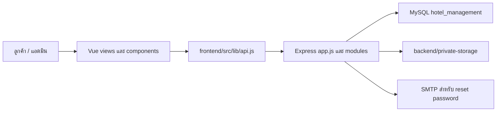
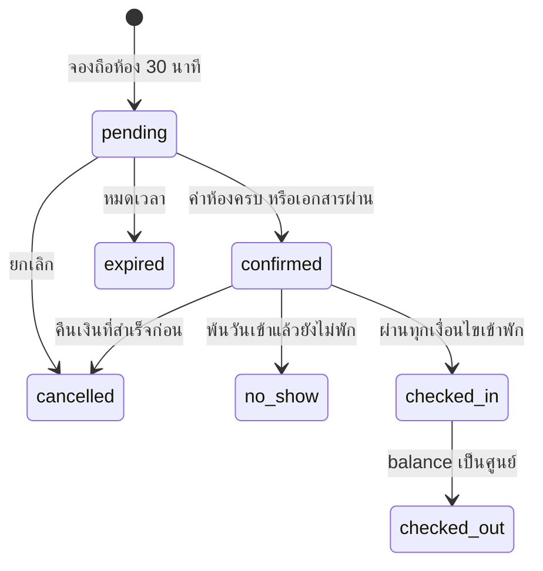

# คู่มือส่งต่อ HMS Hotel สำหรับทีม UX/UI

ตรวจจาก source code วันที่ 2 ตุลาคม 2026 ใช้คู่กับ [แผนที่ทุกไฟล์](FILE-MAP-TH.md) และ [ฐานข้อมูลทุกตาราง/คอลัมน์](DATABASE-DICTIONARY-TH.md)

## 1. ระบบทำอะไรได้

โปรเจคนี้เป็นระบบจองและจัดการโรงแรม ใช้ Vue 3 + Vue Router + Vite เป็นเว็บลูกค้าและแอดมินในแอปเดียว Express เป็น API และ MySQL เป็นฐานข้อมูล 15 ตาราง มี JWT/bcrypt สำหรับบัญชี, Multer สำหรับไฟล์, PDFKit สำหรับใบเสร็จ และ Nodemailer สำหรับรีเซ็ตรหัสผ่าน

| ผู้ใช้ | ฟังก์ชันที่มีในโค้ดแล้ว |
|---|---|
| ยังไม่ล็อกอิน | ดูประเภทห้อง ราคา รูป สิ่งอำนวยความสะดวก ค้นหาห้องว่างตามวันและจำนวนคน ดูข้อมูลติดต่อ |
| customer | สมัคร/ล็อกอิน/รีเซ็ตรหัสผ่าน จองหลายห้อง ดูการจอง ส่งสลิป/บัตรประชาชนหรือพาสปอร์ต ดาวน์โหลดใบเสร็จ ยกเลิกก่อนเข้าพัก แก้โปรไฟล์ |
| admin | จัดการประเภทห้อง ห้องจริง รูปและ amenities ตรวจเงิน/เอกสาร รับเงินสด บันทึกคืนเงิน เช็กอิน/เอาต์ เพิ่มค่าใช้จ่าย ดู dashboard และรายงานเงินพร้อม CSV |



Vue เรียก API ไม่ต่อ MySQL โดยตรง backend ตรวจสิทธิ์ คำนวณยอด และเขียน DB ข้อมูลติดต่อโรงแรม/บัญชีรับเงินเป็น frontend env ส่วนข้อความการตลาด/ภาพประกอบเป็นไฟล์ static

ขอบเขตตรวจ: source/config ตัวอย่าง/scripts/tests/schema/seed/README/manifest/lockfiles และรายการ assets ไม่ไล่อธิบาย dependency ภายนอกใน node_modules, cache, .git หรือ dist ไม่เปิดเผยค่าลับ .env และไม่ได้ตรวจแถวข้อมูลใน MySQL ที่ใช้งานจริง ดังนั้น “ข้อมูลมีให้ใช้” หมายถึง schema/API รองรับ ไม่ได้รับรองว่าฐานข้อมูลจริงกรอกครบ

ผลตรวจรอบนี้: backend `npm.cmd test` ผ่าน 17/17 และ frontend `npm.cmd run build` ผ่าน ไม่ได้รัน integration/MySQL จริงหรือทดสอบทุก flow ผ่าน browser การตรวจนี้ไม่แก้ business logic

## 2. Flow การทำงานและเงื่อนไขที่ UX/UI ต้องรู้

1. ค้นหาด้วย check_in/check_out และผู้ใหญ่/เด็ก **ต่อหนึ่งห้อง** ระบบไม่ได้จัดสรรจำนวนคนรวมไปหลายห้องอัตโนมัติ
2. customer จองผ่าน Booking.vue 4 ขั้น เลือกห้องจริงได้ 1–20 ห้อง กำหนดคนต่อห้องและคำขอเพิ่มเติม
3. backend ตรวจวัน/ความจุ/ห้องซ้ำ/จองทับ ล็อก transaction คิดราคาและเก็บ snapshot ใน booking_rooms สร้าง pending ถือห้อง 30 นาที
4. ลูกค้าส่งสลิป/เอกสารได้ แต่การส่งไฟล์ไม่ยืนยันอัตโนมัติและไม่ขยายเวลาถือห้อง
5. admin ตรวจเงิน successful/failed และเอกสาร approved/rejected รายการตรวจแล้วตรวจซ้ำไม่ได้ ถ้าไม่ผ่านให้ส่งรายการใหม่
6. confirmed เกิดเมื่อ **ค่าห้องชำระครบ หรือเอกสารได้รับอนุมัติ** ตามโค้ดปัจจุบัน
7. เช็กอินต้อง confirmed, อยู่ในช่วงวันเข้า ≤ วันนี้ < วันออก, ค่าห้องชำระครบ, เอกสาร approved อย่างน้อยหนึ่งรายการ และทุกห้อง available ไม่มี stay ค้าง
8. ระหว่าง checked_in เพิ่มค่าใช้จ่ายและรับเงินส่วนเพิ่มได้ เช็กเอาต์ต้อง financial.balance=0 ห้องเปลี่ยนเป็น cleaning จากนั้น admin ตั้ง available หลังทำความสะอาด
9. ยกเลิกได้ pending/confirmed ก่อนพัก ถ้ามีเงิน successful ต้องบันทึกคืนเงินทุก payment ก่อนยกเลิก การ refund เป็น record เท่านั้น ต้องโอนเงินจริงนอกเว็บ คืนเต็ม payment และก่อนเข้าพัก
10. no_show ทำได้เฉพาะ confirmed ที่พ้นวันเข้าแล้วและยังไม่พัก ปุ่มอาจปรากฏก่อนถึงเงื่อนไข backend ยังตรวจและปฏิเสธได้



อย่าใช้ confirmed แทน “พร้อมเช็กอิน” ควรแสดงสถานะจอง เงิน เอกสาร และสิ่งที่ขาดแยกกัน วันออกไม่นับเป็นคืนพัก วันที่ใช้ YYYY-MM-DD และวันนี้คำนวณ Asia/Bangkok expiry อัปเดตทุกนาทีเมื่อ server เปิดและเมื่ออ่านข้อมูลบาง endpoint

room_status เป็นสถานะปฏิบัติงานปัจจุบัน ห้อง occupied/cleaning อาจจองล่วงหน้าได้เมื่อไม่ทับ จึงต้องใช้ availability เพื่อหาห้องว่างตามวัน ผลค้นหายังไม่ล็อกห้อง ต้องรองรับ 409 เมื่อยืนยันจอง

## 3. ติดตั้งตั้งแต่เครื่องใหม่

### 3.1 เตรียมเครื่อง

ติดตั้ง Node.js/npm ให้ตรง dependency ที่ตรวจในเครื่อง: Vite/plugin-vue กำหนด `^20.19.0 || >=22.12.0` ใช้ Node 22.12 ขึ้นไปได้ เครื่องที่ทดสอบนี้ใช้ Node 24.14.1 และ npm 11.11.0 ติดตั้ง MySQL 8.0.16 ขึ้นไปตาม schema พร้อม Workbench หรือ mysql CLI และ editor

XAMPP บางรุ่นใช้ MariaDB ซึ่งยังไม่ได้ตรวจความเข้ากันได้กับ schema นี้ ให้ตรวจฐานข้อมูลก่อน ไม่จำเป็นต้องเปิด Apache ถ้าใช้ Workbench/CLI

รับ repo ด้วย clone หรือ ZIP เปิด PowerShell ที่รากโปรเจค (โฟลเดอร์มี backend/frontend) เปลี่ยน path ให้ตรงเครื่องเพื่อน:

```powershell
Set-Location 'D:\3-1\project_อ.วิภารันต์\HoteL\HoteL'
node --version
npm.cmd --version
```

ไม่มี package.json ราก ต้องติดตั้งแยกสองโฟลเดอร์ ใช้ npm.cmd บน PowerShell เพื่อหลีกเลี่ยง execution policy ของ npm.ps1

### 3.2 สร้าง DB ใหม่

เปิด MySQL แล้วรัน backend/test/schema.sql ทั้งไฟล์ใน Workbench ก่อน จากนั้นรัน backend/test/seed.sql ครั้งเดียว schema สร้าง database hotel_management เอง ไม่ต้องสร้างชื่อเดียวกันก่อน

ถ้าใช้ CLI ให้เปิดจากรากโปรเจค:

```powershell
mysql -u root -p
```

ใน MySQL prompt:

```sql
SOURCE backend/test/schema.sql;
SOURCE backend/test/seed.sql;
USE hotel_management;
SHOW TABLES;
SELECT * FROM room_types;
SELECT * FROM rooms;
```

ถ้า mysql ไม่อยู่ PATH ใช้ path mysql.exe ที่ติดตั้ง ถ้า path ภาษาไทยทำให้ CLI มีปัญหา ให้เปิด SQL ด้วย Workbench

**ห้าม import ซ้ำบน DB ที่มีข้อมูลเดิม** schema ไม่มี IF NOT EXISTS และ seed ใส่ ID ตายตัว หากมีฐานเดิมแล้วให้ตรวจเทียบ schema ไม่ล้างข้อมูล comment ใน seed อ้าง 01_schema.sql แต่ไฟล์ที่มีจริงคือ backend/test/schema.sql

seed มี 4 ประเภท 900/1000/1500/2200 บาท ห้อง 8 ห้อง (101–104,201–204), amenities 6 รายการและ 20 คู่เชื่อม ไม่มีบัญชี รูปจริง การจอง เงิน เอกสาร หรือ stay ราคาเป็นตัวอย่าง ไม่ใช่นโยบายโรงแรมที่ยืนยัน

### 3.3 Backend

```powershell
Set-Location .\backend
npm.cmd ci
if (-not (Test-Path .env)) { Copy-Item .env.example .env }
```

แก้ backend/.env:

```dotenv
PORT=3000
DB_HOST=127.0.0.1
DB_PORT=3306
DB_USER=root
DB_PASSWORD=ใส่รหัสMySQLของคุณ
DB_NAME=hotel_management
JWT_SECRET=ใส่ค่าสุ่มเองอย่างน้อย32bytes
JWT_EXPIRES_IN=1h
CUSTOMER_ORIGIN=http://127.0.0.1:5173
ADMIN_ORIGIN=http://127.0.0.1:5173
PASSWORD_RESET_URL=http://127.0.0.1:5173/reset-password
ADMIN_USERNAME=hotel_admin
ADMIN_EMAIL=ใส่อีเมลของคุณ
ADMIN_PASSWORD=ใส่รหัสผ่านของคุณ
```

แทน placeholder ด้วยค่าจริง ถ้า MySQL ไม่มีรหัสผ่านให้ DB_PASSWORD ว่าง DB_PORT รองรับใน db.js แม้ไม่มีใน .env.example สุ่ม secret ด้วยคำสั่งแล้วใส่ผลใน .env ของตนเอง:

```powershell
node -e "console.log(require('crypto').randomBytes(32).toString('hex'))"
npm.cmd run create-admin
npm.cmd run dev
```

รหัสผ่าน admin/customer อย่างน้อย 8 ตัว มีอังกฤษตัวเล็ก ตัวใหญ่ ตัวเลข อักขระพิเศษ ไม่เกิน 72 bytes; username 3–50 ตัว อังกฤษ/ตัวเลข/_ เท่านั้น create-admin เพิ่ม users ใหม่ role admin ไม่สร้าง customers และไม่แก้บัญชีเดิมเมื่อชื่อ/อีเมลซ้ำ หลังสร้างนำ ADMIN_PASSWORD ออกจาก env ได้ เปิด backend ค้างไว้

### 3.4 Frontend อีก terminal

```powershell
Set-Location 'D:\3-1\project_อ.วิภารันต์\HoteL\HoteL\frontend'
npm.cmd ci
if (-not (Test-Path .env)) { Copy-Item .env.example .env }
npm.cmd run dev
```

frontend/.env ค่าเริ่มต้น:

```dotenv
VITE_API_BASE_URL=/api
API_PROXY_TARGET=http://127.0.0.1:3000
VITE_HOTEL_PHONE=
VITE_HOTEL_EMAIL=
VITE_HOTEL_ADDRESS=
VITE_BANK_NAME=
VITE_BANK_ACCOUNT=
VITE_BANK_OWNER=
VITE_PROMPTPAY_ID=
```

เปิด http://127.0.0.1:5173 admin/customer ใช้เว็บพอร์ตเดียว ล็อกอิน admin ไป /admin ไม่ต้องเปิดพอร์ต 5174 ตัวอย่าง backend เดิมใช้ localhost/5174 ให้ปรับ origins และ reset URL ให้ตรง URL จริงโดยเฉพาะเมื่อเรียก API ข้าม origin

ใส่โทร/อีเมล/ที่อยู่โรงแรม/บัญชีรับเงินใน VITE_* แล้ว restart Vite ตัวแปรนี้ browser อ่านได้ ห้ามใส่ DB password, JWT secret หรือ SMTP password

### 3.5 อีเมลและทดสอบเปิด

เมื่อจะใช้ forgot-password ตั้ง SMTP_HOST,SMTP_PORT,SMTP_SECURE,SMTP_USER,SMTP_PASSWORD,MAIL_FROM,PASSWORD_RESET_URL ใน backend/.env ตามผู้ให้บริการแล้ว restart reset token ใช้ครั้งเดียวอายุ 30 นาที ระบบส่วนอื่นไม่ต้องมี SMTP แต่ reset ต้องตั้งให้ครบ

```powershell
Invoke-RestMethod 'http://127.0.0.1:3000/api/health'
Invoke-RestMethod 'http://127.0.0.1:3000/api/room-types'
```

health ต้อง data.status=ok/database=connected เปิดเว็บดูห้อง สมัคร customer ใหม่ ล็อกอินด้วย username (ไม่ใช่ email) แล้วทดลอง flow ใน DB พัฒนา: จองวันนี้ถึงพรุ่งนี้ → ส่งเอกสาร/เงิน → admin ตรวจ → เช็กอิน → charge → รับยอดเพิ่ม → เช็กเอาต์ → available → ใบเสร็จ/รายงาน

| ที่รัน | คำสั่ง | หน้าที่ |
|---|---|---|
| backend | npm.cmd test | 17 tests DB จำลอง |
| backend | npm.cmd run test:integration | สร้าง MySQL hotel_test_<random> และลบหลังทดสอบ ต้อง CREATE/DROP DATABASE; SMTP จำลอง |
| backend | npm.cmd start | API ไม่มี nodemon |
| frontend | npm.cmd run build | compile สร้าง dist |
| frontend | npm.cmd run preview | ดู build พอร์ต 4173 มี proxy |

### 3.6 แก้ปัญหาเบื้องต้น

| อาการ | ตรวจอะไร |
|---|---|
| npm ไม่มี package.json | เข้า backend/frontend ไม่ใช่ราก |
| server บอก JWT_SECRET | ใส่ค่าสุ่มอย่างน้อย 32 bytes |
| health DB fail | MySQL เปิดอยู่ ค่า DB_* ถูก schema มีแล้ว |
| create-admin ซ้ำ | ใช้บัญชีเดิมหรือชื่อ/อีเมลใหม่ ไม่ใช่คำสั่ง reset |
| เว็บต่อ API ไม่ได้ | พอร์ต 3000, backend terminal, API_PROXY_TARGET |
| พอร์ตถูกใช้ | Ctrl+C server เดิมใน terminal ของตน frontend strictPort ไม่เปลี่ยนพอร์ตเอง |
| 401/403 | ล็อกอินใหม่/ตรวจบทบาทและเจ้าของข้อมูล |
| 409 | สถานะขัด/ห้องถูกจอง/เงื่อนไขยังไม่ครบ อ่าน error แล้วโหลดใหม่ |
| รูปประกอบ | room_images ว่าง ต้อง admin upload |
| reset ไม่ได้อีเมล | ตรวจ SMTP และ URL ข้อความตอบกลับไม่เปิดเผยบัญชีและอาจเหมือนเดิมเมื่อส่งเมลล้มเหลว |
| เช็กอิน/เอาต์ไม่ผ่าน | ตรวจวัน ห้อง available เงินครบ เอกสาร approved และ balance |

## 4. หน้าเว็บ → API → database → ไฟล์ที่จะทำ UI

ไฟล์ในตารางอยู่ frontend/src/views; API เติม /api หน้าทุก path

| URL เว็บ | ไฟล์ | API/ข้อมูล | ตาราง |
|---|---|---|---|
| / | Home.vue | GET /room-types ประเภทแนะนำ 3 รายการแรก | room_types,room_images |
| /rooms | Rooms.vue | GET /room-types เมื่อไม่เลือกวัน หรือ /rooms/availability เมื่อเลือกวัน | room_types,rooms และ bookings/booking_rooms/stays เพื่อกันห้อง |
| /rooms/:id | RoomDetail.vue | GET /room-types/:id gallery/specs/amenities | room_types,room_images,amenities,room_type_amenities |
| /login,/register,/forgot-password,/reset-password | Auth.vue | POST /auth/login,/register,/forgot-password,/reset-password | users,customers,password_reset_tokens |
| /booking | Booking.vue | GET availability,/me/profile; POST /bookings | customers,rooms,room_types,bookings,booking_rooms,stays |
| /my-bookings | MyBookings.vue | GET /me/bookings รายการตนเอง | bookings,customers |
| /admin/bookings | MyBookings.vue | GET /admin/bookings รายการทุกคน | bookings,customers |
| /bookings/:id | BookingDetail.vue | GET /bookings/:id และ actions เงิน/เอกสาร/พัก/ยกเลิก | วงจรจอง เงิน เอกสาร stay charges receipts |
| /profile | Profile.vue | GET/PATCH /me/profile และ session user | customers,users |
| /contact | Contact.vue | ไม่มี API ใช้ VITE_HOTEL_* | ไม่มี |
| /admin | AdminDashboard.vue | GET /admin/dashboard,/admin/bookings?limit=5 | rooms,bookings,payments,identity_documents,customers |
| /admin/room-types | AdminCatalog.vue | CRUD /admin/room-types พร้อมรูป/amenities | room_types,room_images,amenities,room_type_amenities |
| /admin/rooms | AdminCatalog.vue | CRUD /admin/rooms และ list ประเภท | rooms,room_types; ตรวจ bookings/booking_rooms/stays |
| /admin/amenities | AdminCatalog.vue | GET/POST/PATCH /admin/amenities | amenities |
| /admin/payments | AdminReviews.vue | list/proof/verify/refund | payments,bookings,receipts และ helper finance |
| /admin/documents | AdminReviews.vue | list/file/review เอกสาร | identity_documents,bookings |
| /admin/reports | AdminReports.vue | GET /admin/reports/cash-flow?from=...&to=... | payments |
| หน้าอื่น | NotFound.vue | 404 ไม่มี API | ไม่มี |

ID ต้องแยก: /rooms/:id ของเว็บเป็น **room_type_id**; จองต้องใช้ **room_id** จาก availability; /bookings/:id เป็น **booking_id**; เพิ่ม charge ใช้ **stay_id**

## 5. ข้อมูลที่อยากใช้ต้องเอาจากไหน

| ต้องการแสดง | field / endpoint | เริ่มแก้ไฟล์ | ข้อควรรู้ |
|---|---|---|---|
| ชื่อ รายละเอียด ราคา ความจุ | /room-types หรือ detail: type_name,description,price_per_night,adult_capacity,child_capacity | Rooms,RoomDetail,RoomCard | list public ไม่มี bed_count แต่ detail มี |
| รูปหลัก/gallery | list image_url; detail images[].url | RoomCard,RoomDetail | null/[] ได้ ใช้ภาพประกอบ fallback |
| เตียง ขนาด amenities | detail bed_count,bed_type,room_size,amenities[] | RoomDetail | icon string ไม่แปลงเป็นรูปอัตโนมัติ |
| หมายเลข ชั้น ห้องว่าง ราคาทริป | availability room_id,room_number,floor,nights,estimated_room_total | Rooms,Booking | ไม่มีรูป/amenities ใน response; ราคาเป็นประมาณก่อนยืนยัน |
| ชื่อ โทร ที่อยู่ | /me/profile | Profile,Booking | ไม่มี customer list ทั้งหมด |
| username/email/role | /me และ session.user | api.js,App,Profile | ไม่อยู่ /me/profile |
| ข้อมูลจองครบ | /bookings/:id: rooms,payments,documents,receipts,stay,charges | BookingDetail | owner/admin เท่านั้น |
| ค่าห้อง/ส่วนเพิ่ม/จ่ายแล้ว/คงเหลือ | financial.room_amount,additional_amount,grand_total,paid_amount,balance | BookingDetail | bookings.total_amount คือค่าห้องอย่างเดียว |
| เงินรอตรวจ | payments[] กรอง pending | BookingDetail | payable = balance - pendingSum ไม่ส่งซ้ำเกินยอด |
| สลิป/เอกสาร | /payments/:id/proof,/identity-documents/:id/file | api.js,AdminReviews | fetch มี Bearer แล้ว Blob ไม่ใช้ file_path public |
| ใบเสร็จ | receipts[] และ /receipts/:id/pdf | BookingDetail | ต่อ payment สำเร็จ ไม่ใช่ใบกำกับภาษี PDF สร้างขณะเรียก |
| เวลาพักจริง ค่าใช้จ่ายเพิ่ม | stay,charges[] ใน detail | BookingDetail | stay=null ก่อนเช็กอิน |
| จำนวนห้อง/รอตรวจ/เข้าวันนี้ | /admin/dashboard | AdminDashboard | ไม่ใช่ occupancy rate รายวัน |
| รับ/คืน/สุทธิรายวัน | cash-flow: event_date,received_amount,refunded_amount,net_cash_flow | AdminReports | ไม่ใช่กำไร วันที่รับคือเวลาตรวจเงิน successful |
| โทร/อีเมล/ที่อยู่โรงแรม | VITE_HOTEL_* | Contact | env ไม่มีตารางโรงแรม |
| ธนาคาร/พร้อมเพย์ | VITE_BANK_*,VITE_PROMPTPAY_ID | BookingDetail | ข้อความรับโอน ไม่มี QR/gateway |
| สี/layout/fonts | tokens.css/style.css/main.js | ไฟล์เดียวกัน | ไม่ใช่ DB |

คอลัมน์มีใน DB ไม่ได้แปลว่าเรียกใช้หรือบันทึกได้ทันที เช่น customers.birth_date/gender/nationality ยังไม่มี API profile รองรับ รายละเอียดทุกคอลัมน์และไฟล์ที่ต้องขยายอยู่ DATABASE-DICTIONARY-TH.md

## 6. วิธีใช้ API เดิมในการทำ UI

```javascript
import { api, download, url } from '../lib/api';
// เรียกใน async function/onMounted แล้วเก็บ data ใน ref
const { data } = await api('/room-types/1');
const imageSrc = data.images.length ? url(data.images[0].url) : '/room-1.jpg';

const form = new FormData();
form.set('document_type', 'national_id');
form.set('file', selectedFile);
await api(`/bookings/${bookingId}/identity-documents`, { method: 'POST', body: form });
await download(`/receipts/${receiptId}/pdf`, 'receipt.pdf');
```

api.js ใส่ Bearer/JSON และอ่าน error ให้แล้ว อย่าเติม /api ซ้ำใน path; FormData ไม่ตั้ง Content-Type เอง token อยู่ sessionStorage.hotel.token; logout ล้างฝั่ง browser ไม่มี revoke endpoint

```javascript
const { data: booking } = await api('/bookings', {
  method: 'POST',
  body: {
    check_in_date: checkIn,
    check_out_date: checkOut,
    rooms: [{ room_id: selectedRoom.room_id, adult_count: 2, child_count: 0 }],
    special_request: 'ขอห้องเงียบ',
  },
});
```

ห้ามส่ง customer_id,total_amount,booking_status เอง ราคา authoritative มาจาก backend response `{data:...}`; error `{error:{code,message,details?}}`; DECIMAL มักเป็น string "900.00" ใช้ Number เพื่อจัดรูปแบบเท่านั้น

ดู endpoint/input ทั้งชุดใน [backend/API-CONTRACT.md](../backend/API-CONTRACT.md) โดยเพิ่มข้อมูลที่เอกสารเดิมตกหล่น: **GET /api/me/profile** มีจริงใน catalog.routes.js คืน customer_id,first_name,last_name,phone,address,province,postal_code; PATCH รับ 6 fields หลัง customer_id

| action | endpoint (เติม /api) | body/สิทธิ์ |
|---|---|---|
| ยกเลิก | PATCH /bookings/:id/cancel | {reason?} owner/admin |
| ไม่มา | PATCH /admin/bookings/:id/no-show | admin หลังวันเข้า |
| ส่งเงิน | POST /bookings/:id/payments | amount,payment_method,reference_number?,note?,file; owner/admin; cash เฉพาะ admin |
| ตรวจเงิน | PATCH /admin/payments/:id/verify | {status:"successful"/"failed",note?} admin |
| คืนเงิน | PATCH /admin/payments/:id/refund | {note} admin จำเป็น |
| ส่งเอกสาร | POST /bookings/:id/identity-documents | FormData document_type national_id/passport,file |
| ตรวจเอกสาร | PATCH /admin/identity-documents/:id/review | {status:"approved"/"rejected",note?} admin |
| เช็กอิน | POST /admin/bookings/:id/check-in | {} หรือ {note} admin |
| charge | POST /admin/stays/:id/additional-charges | charge_name,quantity?,unit_price,note? admin |
| เช็กเอาต์ | POST /admin/bookings/:id/check-out | admin balance=0 |
| รูปห้อง | POST /admin/room-types/:id/images | FormData file,description?,is_primary="true"/"false",display_order? admin |
| ลบรูป | DELETE /admin/room-images/:id | admin |
| ผูก amenities | PUT /admin/room-types/:id/amenities | {amenity_ids:[1,2]} แทนชุดเดิม admin |

อัปโหลด file หนึ่งไฟล์/request สูงสุด 5 MB PNG/JPEG/PDF; รูปห้อง PNG/JPEG เท่านั้น เนื้อไฟล์อยู่ backend/private-storage และ DB เก็บ key ไม่ส่ง path จาก UI

รายการเงิน/เอกสารคืน page/limit แต่ไม่มี total; ห้อง/ประเภท/จอง/availability มี total; amenities ไม่มี server pagination อย่าแสดงจำนวนหน้ารวมจากค่าที่ไม่มี

## 7. แนวทาง UX/UI และข้อจำกัดที่พบ

เริ่ม router.js แล้วแก้ view ตามหัวข้อ 4 สีหลัก tokens.css; style.css มี layout/responsive/reduced-motion แต่สีบางจุด hardcode; main.js import Prompt หัวข้อและ Sarabun เนื้อหา components ใช้ซ้ำได้: RoomCard,SearchForm,StatusBadge,StatePanel (loading/error/empty/retry),AppModal (focus/Escape/Tab),ui.js notify toast

ออกแบบ loading/empty/error/กำลังบันทึก/ไม่มีสิทธิ์ทุกหน้า แยก pending booking/payment/document ให้ผู้ใช้เข้าใจ แสดงหมดเวลาถือห้องและ checklist เช็กอิน ปิดปุ่มระหว่างรอ และรักษา field/status/request เดิมเมื่อเปลี่ยนหน้าตา

MyBookings/BookingDetail ใช้สองบทบาท; AdminCatalog ใช้ 3 หน้า; AdminReviews ใช้ 2 หน้า; Auth ใช้ 4 หน้า ต้องตรวจทุกโหมดเมื่อแก้ เพิ่ม route.meta.auth/customer/admin ได้ แต่สิทธิ์จริงต้องตรวจ backend ด้วย

| ข้อจำกัด/ข้อสังเกต | ผลต่อการออกแบบ |
|---|---|
| ไม่มี payment gateway/QR/refund transfer | ออกแบบรับโอน-ตรวจหลักฐานและยืนยันว่าคืนเงินจริงนอกระบบ |
| ไม่มีแก้วัน/เปลี่ยนห้อง/เลื่อนจอง API | ต้องพัฒนากฎและ endpoint เพิ่ม |
| ไม่มี user/customer admin API | หน้ารายชื่อลูกค้า/เปลี่ยน role/ปิดบัญชียังทำด้วย API เดิมไม่ได้ |
| ไม่มีหลายโรงแรม ราคาฤดูกาล คูปอง ภาษี อาหารเช้า คะแนนรีวิว | ต้องออกแบบ DB/backend เพิ่ม; AdminReviews คือการตรวจเอกสารและเงิน |
| ไม่มี DELETE amenities | ใช้ inactive; handler ลบทั่วไปใน AdminCatalog ไม่ควรนำมาใช้ยิง endpoint ที่ไม่มี |
| ไม่มี patch metadata รูปเดิม | description/primary/order ตั้งตอน upload ได้ แต่จัดลำดับรูปเดิมต้องเพิ่ม API |
| availability ไม่มี image_url | ผลค้นหาใช้ fallback แม้ประเภทมีรูปจริง ต้อง mapping/join เพิ่ม |
| RoomCard ใช้ image_url ตรง | ถ้าแยก API ต่างโดเมนปรับผ่าน url() เหมือน gallery |
| Rooms/Booking โหลด limit=100 หน้าแรก | API รองรับ pagination แต่ UI ยังไม่โหลดห้องเกิน 100 |
| confirmed ไม่แปลว่าจ่ายครบและเอกสารผ่านพร้อมกัน | แสดง checklist ก่อนเช็กอิน |
| receipt เดิมยังอยู่หลัง refund | PDF แสดง refunded เป็นประวัติ ไม่ใช่ใบกำกับภาษี |
| JWT ก่อน reset ยังใช้ได้จนหมดอายุ | ไม่มี server logout/revoke/refresh; disabled ตรวจทุก request |
| เปลี่ยนประเภท inactive ไม่ตรวจ future bookings แบบห้องจริง | ต้องกำหนด flow ปิดขายให้ชัด |
| DB pool ไม่กำหนด timezone | NOW()/DATE() ใช้ DB timezone แต่ UI countdown +07:00 ต้องตั้งเวลาให้ตรงเมื่อ deploy |
| README บางไฟล์ยังบอก frontend/bookings/admin ไม่ทำ | โค้ดปัจจุบันมีแล้ว ให้ยึดคู่มือนี้และ route code |

การ deploy ยังต้อง web server SPA fallback ไป index.html, reverse proxy /api ไป Express, HTTPS, origins/SMTP/โดเมนจริง และสำรองทั้ง DB+private-storage การสำรอง DB อย่างเดียวไม่มีเนื้อไฟล์แนบ คู่มือนี้ไม่ได้ยืนยัน production readiness

## 8. ข้อความและไฟล์ส่งให้เพื่อน

ส่ง repo พร้อม docs ทั้ง 3 ไฟล์และ API-CONTRACT.md ให้เพื่อนตั้ง env/MySQL เอง localhost ของเพื่อนคือเครื่องเพื่อน แบ่ง branch ลูกค้า/แอดมินและตกลงเจ้าของ CSS กลางกับ view ร่วมก่อน ถ้าจะเพิ่มข้อมูลระบุ “หน้าจอ → field → API → ตาราง → backend file” แล้วพัฒนาร่วมกัน

> โปรเจคนี้มี Vue เว็บลูกค้าและแอดมินในแอปเดียว ลูกค้าค้นหาและจองหลายห้อง ส่งสลิป/เอกสาร ติดตามการจองและโหลดใบเสร็จ แอดมินจัดการห้อง ตรวจเงิน/เอกสาร เช็กอิน/เอาต์ เพิ่มค่าใช้จ่ายและดูรายงาน ใช้ Express API ต่อ MySQL 15 ตาราง เริ่มอ่าน docs/PROJECT-HANDOFF-TH.md แล้วดู FILE-MAP-TH.md และ DATABASE-DICTIONARY-TH.md เพื่อรู้ว่าหน้าจอใช้ข้อมูลจากไฟล์/API/ตารางไหน confirmed ยังต้องผ่านเงื่อนไขเช็กอิน และคืนเงินเป็นบันทึกหลังโอนคืนภายนอกเว็บ
